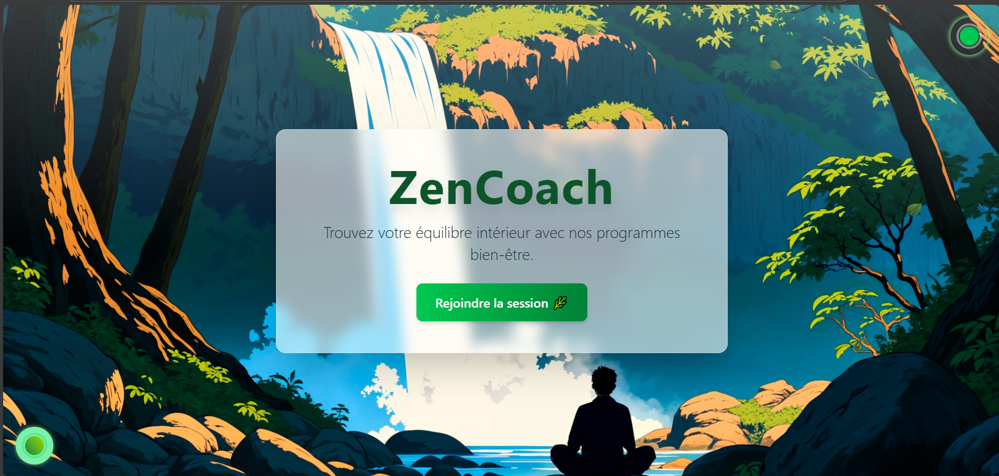

# 🌿 ZenCoach — Landing Page Animée (Style Ghibli / Manga)

<p align="center">
  
</p>

**ZenCoach** est une landing page immersive et narrative conçue pour les coachs bien-être, formateurs ou créateurs de contenu.  
Elle propose une expérience visuelle unique inspirée de l’univers **Ghibli** et du **zen japonais**, combinant animations cinématiques, effets interactifs, et ambiance sonore.

🔗 **Démo en ligne** : [https://zencoach2.netlify.app/](https://zencoach2.netlify.app/)

---

## ✨ Fonctionnalités

- ⚡️ Animations GSAP (effets de révélation cinématographique)
- 🎨 Menu magique avec couleurs dynamiques par section
- 📱 Design 100% responsive (mobile, tablette, desktop)
- 🧘‍♂️ Sections : Hero, À propos, Services, Contact
- 🔊 Sons d’ambiance par section (zen, nature, relaxation)
- 🍃 Brume flottante, feuilles animées, effets Ghibli/Manga

---

## 🧱 Technologies utilisées

- **React + TypeScript + Vite**
- **Tailwind CSS**
- **GSAP** (animations avancées)
- **Framer Motion** (menu animé)
- Déploiement via **Netlify**

---

## 📁 Structure du projet (extrait)

├── README.md
├── preview2.png
├── public/
│ └── [images, sons, vidéos]
├── src/
│ ├── components/
│ │ ├── Hero.tsx
│ │ ├── About.tsx
│ │ ├── Services.tsx
│ │ ├── Contact.tsx
│ │ └── MagicMenu.tsx
│ ├── assets/
│ └── main.tsx
└── vite.config.ts


## 🧠 Auteur  
Un projet imaginé et réalisé par **SAYATH**, inspiré par l’univers Ghibli et la quête de sérénité digitale.  
👁️‍🗨️ D’autres créations arrivent bientôt…


---

## 🚀 Lancer le projet localement

Assurez-vous d’avoir **Node.js** et **npm** installés sur votre machine.

```bash
# Télécharger les fichiers du projet (via ZIP ou Git)
# puis se placer dans le dossier
cd zencoach-template

# Installer les dépendances
npm install

# Démarrer le serveur local
npm run dev

